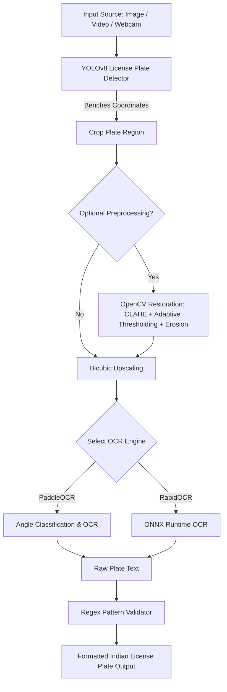

# 🚗 Real-Time Automatic Number Plate Recognition (ANPR) System

A robust, high-performance, and deep-learning-based Automatic Number Plate Recognition (ANPR) pipeline. This system leverages a custom-trained **YOLOv8** model for highly accurate license plate detection, and integrates **PaddleOCR** and **RapidOCR** engines for text extraction. It is optimized for processing challenging, weathered, low-contrast, or faded license plates, particularly following standard Indian license plate structures.

---

## 🌟 Key Features

*   **Precision Object Detection:** Dynamic license plate localization using a custom-trained YOLOv8 detector (`model/exp-4.pt`) with explicit CUDA acceleration support.
*   **Dual OCR Engines Support:**
    *   **PaddleOCR:** Direction-aware text recognition with angle classification.
    *   **RapidOCR:** Ultra-fast, lightweight ONNX-runtime based text extraction.
*   **Dual-Stream Side-by-Side Dashboard:** A beautiful, responsive Flask-based web control center interface showing real-time comparison between PaddleOCR and RapidOCR.
*   **Indian License Plate Parsing & Filtering:** Rigid regex-based formatting and validation filters to clean OCR outputs and eliminate non-plate noise.
*   **Optional Image Restoration Preprocessing:** A custom-engineered preprocessing pipeline (Grayscale + CLAHE + Adaptive Gaussian Thresholding + Morphological Erosion) to reconstruct degraded or faded characters before OCR.
*   **Flexible Inputs:** Support for static images, pre-recorded video files, local laptop webcams, and network IP camera streams.

---

## 🏗️ System Architecture



---

## 📁 Repository Structure

```directory
├── dataset/                     # Directory for training or evaluation datasets
├── model/                       # Trained weights & models
│   ├── exp-4.pt                 # Custom YOLOv8 model for license plate detection
│   └── ch_lprnet_baseline18_deployable.onnx  # Pre-trained LPRNet baseline model
├── testimg/                     # Test images & sample video clips for validation
├── vc/                          # Visual C++ redistributable packages
├── app.py                       # Flask Web App for side-by-side real-time stream comparison
├── opencv_restoration.py        # Pre-processing module for low-contrast/faded plates
├── run_video_pipeline.py        # Frame-by-frame video processing and validation pipeline
├── test_camera.py               # PaddleOCR-based live webcam / network stream analyzer
├── test_laptop_camera.py        # RapidOCR-based live webcam analyzer
├── test_lprnet.py               # Regex-validated static image OCR using PaddleOCR
├── test_paddleocr.py            # Basic PaddleOCR installation sanity check
├── test_pipeline.py             # Simple YOLO + PaddleOCR static image inference script
├── test_rapidocr.py             # Basic RapidOCR installation sanity check
└── README.md                    # Detailed project documentation
```

---

## ⚙️ Installation & Setup

### 1. Prerequisites
*   Python 3.8 to 3.11 recommended.
*   CUDA Toolkit and cuDNN installed (matching PyTorch version) for GPU acceleration.

### 2. Set Up a Virtual Environment
```bash
# Create virtual environment
python -m venv venv

# Activate virtual environment
# On Windows:
venv\Scripts\activate
# On Linux/macOS:
source venv/bin/activate
```

### 3. Install Dependencies
Install PyTorch with CUDA support first, then install the remainder of the requirements:

```bash
# Install PyTorch (CUDA 11.8 Example)
pip install torch torchvision --extra-index-url https://download.pytorch.org/whl/cu118

# Install general dependencies
pip install ultralytics paddleocr paddlepaddle opencv-python rapidocr_onnxruntime Flask
```
> [!NOTE]
> If you have a GPU and want GPU-accelerated PaddleOCR, install `paddlepaddle-gpu` instead of `paddlepaddle`:
> `pip uninstall paddlepaddle && pip install paddlepaddle-gpu`

---

## 🚀 Running the Flask Control Center Dashboard

Experience real-time dual-stream ANPR directly in your web browser. This application runs YOLOv8 and pipes the stream into both OCR engines simultaneously in a side-by-side premium web interface.

1.  Connect your webcam/camera.
2.  Start the Flask server:
    ```bash
    python app.py
    ```
3.  Open your browser and navigate to: `http://127.0.0.1:5000`

*   **Cyan Feed:** Represents the **RapidOCR** (ONNX Runtime) processing flow.
*   **Green Feed:** Represents the **PaddleOCR** processing flow.

---

## 🛠️ Command-Line Utility Scripts

### 1. End-to-End Image Inference (`test_pipeline.py`)
Quickly runs license plate detection and PaddleOCR text extraction on a single image.
```bash
python test_pipeline.py --image "testimg/UP17.jpg" --model "model/exp-4.pt"
```

### 2. Regex-Validated Inference (`test_lprnet.py`)
Extracts text and validates it against standard Indian license plate patterns:
$$\text{State Code (2 letters)} + \text{District Code (2 digits)} + \text{Series (1-3 letters)} + \text{Unique Number (4 digits)}$$
```bash
python test_lprnet.py --image "testimg/UP17.jpg"
```

### 3. Live Video Pipeline (`run_video_pipeline.py`)
Processes a local `.mp4` video clip frame-by-frame, applying scaling, YOLO detection, PaddleOCR, and printing structured detection lists.
```bash
python run_video_pipeline.py
```

### 4. PaddleOCR Webcam Utility (`test_camera.py`)
Runs live camera analysis using PaddleOCR. Supports exporting video overlays and logging text output.
```bash
python test_camera.py --source 0 --output output.mp4 --export-txt detected.txt
```

### 5. Urban / Laptop Webcam Utility (`test_laptop_camera.py`)
Runs live webcam analysis using RapidOCR with high frame rate capabilities.
```bash
python test_laptop_camera.py --model "model/exp-4.pt"
```

---

## 🩹 Advanced Pre-Processing for Faded Plates (`opencv_restoration.py`)

Standard OCR systems struggle with faded paint, dust, weathering, and harsh glare. When dealing with difficult plates, import the restoration module to preprocess crop regions before sending them to OCR:

```python
from opencv_restoration import restore_faded_plate

# 1. Capture/detect number plate crop from YOLO
cropped_plate = frame[y1:y2, x1:x2]

# 2. Apply OpenCV Restoration
restored_plate = restore_faded_plate(cropped_plate)

# 3. Feed the restored plate to the OCR model
ocr_result = ocr(restored_plate)
```

### How Preprocessing Works:
1.  **Grayscale Conversion:** Filters out color noise.
2.  **CLAHE (Contrast Limited Adaptive Histogram Equalization):** Amplifies local text-to-background contrast.
3.  **Adaptive Gaussian Thresholding:** Dynamically handles uneven lighting across the plate surface.
4.  **Morphological Erosion:** Reconstructs thin/faded character strokes into solid structures.

---

## 📊 OCR Engines Comparison

| Feature | PaddleOCR | RapidOCR |
| :--- | :--- | :--- |
| **Accuracy** | High (Excellent on multi-line text & angles) | Moderate-High (Optimized for standard orientations) |
| **Speed** | Moderate (Requires GPU optimization) | Fast (highly optimized ONNX Runtime) |
| **Footprint** | Heavy installation size | Lightweight, minimal dependencies |
| **Use-Case** | Complex plates, angled text, low contrast | High frame-rate live feeds, edge devices |

---

## 👥 Contributors
*   **iam_just_ken** ([github/guru5176](https://github.com/guru5176))
